# 🧠 PolyMind: AI-Gated Quantitative Execution Engine
### *Institutional-Grade Arbitrage Strategy for Prediction Markets*

[](https://www.python.org/)
[](https://xgboost.readthedocs.io/)
[]()
[](https://github.com/eatosin/PolyMind-Crypto-Arbitrage/blob/main/PolyMind_Strategy.ipynb)

[View Demo](#-performance-the-alpha) • [Read the Logic](#-the-mathematical-edge) • [Install](#-quick-start)

</div>

---

## 📉 The "Speed Trap" Problem
In Prediction Markets (e.g., Polymarket, Kalshi), arbitrage opportunities are fleeting. Traditional bots compete on **Latency (Speed)**.
*   **The Trap:** A naive bot sees a price spread ($0.05) and executes.
*   **The Reality:** Low liquidity causes **Slippage**. The order fills at a worse price, turning a theoretical profit into a realized loss.
*   **The Result:** "Toxic Flow" bankruptcy.

## 💡 The PolyMind Solution
**PolyMind** replaces Speed with **Probability**. It utilizes a Gradient Boosted Decision Tree (XGBoost) to act as an "Execution Gate." Before any trade is submitted, the AI analyzes Level 2 Order Book dynamics to predict the probability of a successful fill.

> *"We don't trade often. We trade when we win."*

---

## 📊 Performance: The Alpha
We simulated **1,000 trades** in a hostile market environment specifically designed with "Liquidity Traps" (High Spread / Zero Depth).


| Strategy | Execution Logic | Final PnL | Result |
| :--- | :--- | :--- | :--- |
| 🔴 **Naive Bot** | `if Spread > $0.02` | **-$7,845** | 💀 Bankruptcy (Slippage) |
| 🟢 **PolyMind AI** | `if AI_Confidence > 90%` | **+$18,211** | 🚀 Profit (Alpha) |

---

## 📐 The Mathematical Edge
PolyMind treats execution as a classification problem, not a regression problem.

$$ P(Success) = \sigma( w_1 \cdot Spread + w_2 \cdot Depth - w_3 \cdot Volatility ) $$

Where the execution gate logic is defined as:

$$ Action = \begin{cases} \text{EXECUTE} & \text{if } P(Success) > 0.90 \\ \text{REJECT} & \text{if } P(Success) \le 0.90 \end{cases} $$

This non-linear filtering allows the system to ignore 80% of "noisy" signals that trap standard algorithms.

---

## ⚙️ System Architecture

The system is designed as a modular microservice pipeline.

```mermaid
flowchart LR
    A[("Market Data Stream")] --> B(Feature Engineering)
    B --> C{XGBoost Model}
    C -- "Confidence < 90%" --> D[🛑 Reject Trade]
    C -- "Confidence > 90%" --> E[✅ Execute Order]
    E --> F[("Portfolio Manager")]
    D --> G[("Risk Logs")]
    
    style C fill:#f9f,stroke:#333,stroke-width:2px
    style E fill:#bbf,stroke:#333,stroke-width:2px
```



### Key Components
1.  **Market Simulator:** Generates synthetic Level 2 data (Spread, Liquidity, Volatility) with realistic "Trap" injection.
2.  **Alpha Model:** XGBoost Classifier trained on 5,000 historical trade scenarios to detect "Toxic Flow."
3.  **Execution Engine:** Python class that mimics a live trading loop with latency simulation.

---

## 🚀 Quick Start

### Prerequisites
*   Python 3.8+
*   Jupyter Notebook / Google Colab

### Installation
```bash
# 1. Clone the repository
git clone https://github.com/eatosin/PolyMind-Crypto-Arbitrage.git

# 2. Install dependencies
pip install xgboost pandas numpy scikit-learn matplotlib
```

### Running the Backtest
Open `PolyMind_Strategy.ipynb` and run all cells to:
1.  Generate fresh synthetic market data.
2.  Train the XGBoost model in real-time.
3.  Visualize the PnL curve against a Naive Bot.

---

## 👨‍🔬 Author
**Owadokun Tosin Tobi**
*Physicist & Quant Developer*

*   **Research:** [ReasonBench (LLM Evaluation)](https://github.com/eatosin/ReasonBench)
*   **Engineering:** [Sentinel (MLOps)](https://github.com/eatosin/Sentinel-MLOps)
*   **Forensics:** [Spectre (Deepfake Detection)](https://github.com/eatosin/Spectre-Deepfake-Detector)

---
*Disclaimer: This software is for educational and research purposes only. Do not use for live financial trading without rigorous risk management.*
```